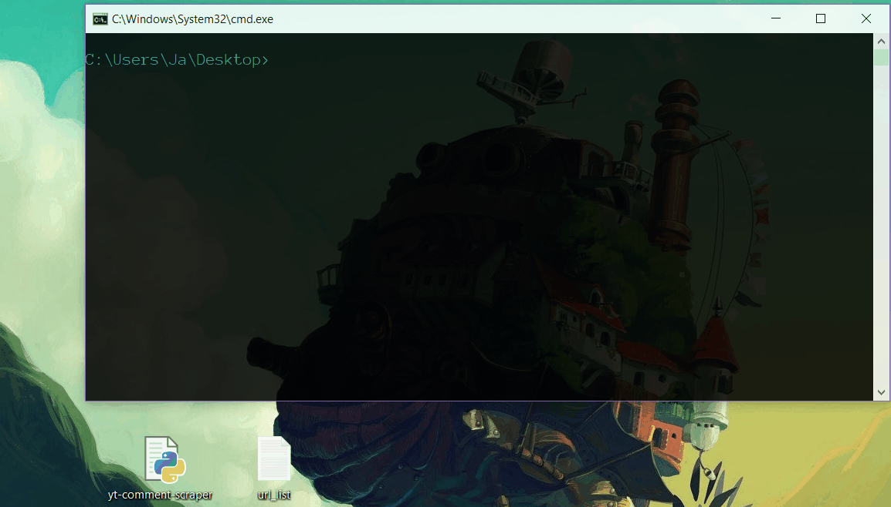

# Youtube comment downloader
### A simple python 3 script to download comments from many videos using youtube v3 API
###### **This was just my attempt at learning some datamining. I wrote it to gather text data to train NLP algorithms.*

<br>

### Usage

- you need to get the API key from Google API console in order to use this script, you can get it here:  
https://console.developers.google.com/apis/credential
- go to https://console.developers.google.com/apis/library/youtube.googleapis.com and click on 'enable' button if it appears
- the comments are downloaded from each video on url list file, each url should be in new line (see url_list.txt file)
- it can filter comments based on amount of likes.  
- the output is single txt file.   
- all non ascii characters are replaced with '?'

```
yt-comment-scraper.py [--key KEY] [--likes LIKES] [--input INPUT]
                             [--output OUTPUT] [--help]

Download youtube comments from many videos into txt file

required arguments:
  --key KEY, -k KEY     Required API key you can get here:
                        https://console.developers.google.com/apis/credentials

optional arguments:
  --likes LIKES, -l LIKES
                        The amount of likes a comment needs to be saved
  --input INPUT, -i INPUT
                        URL list file name
  --output OUTPUT, -o OUTPUT
                        Output file name
  --help, -h            Help
```


